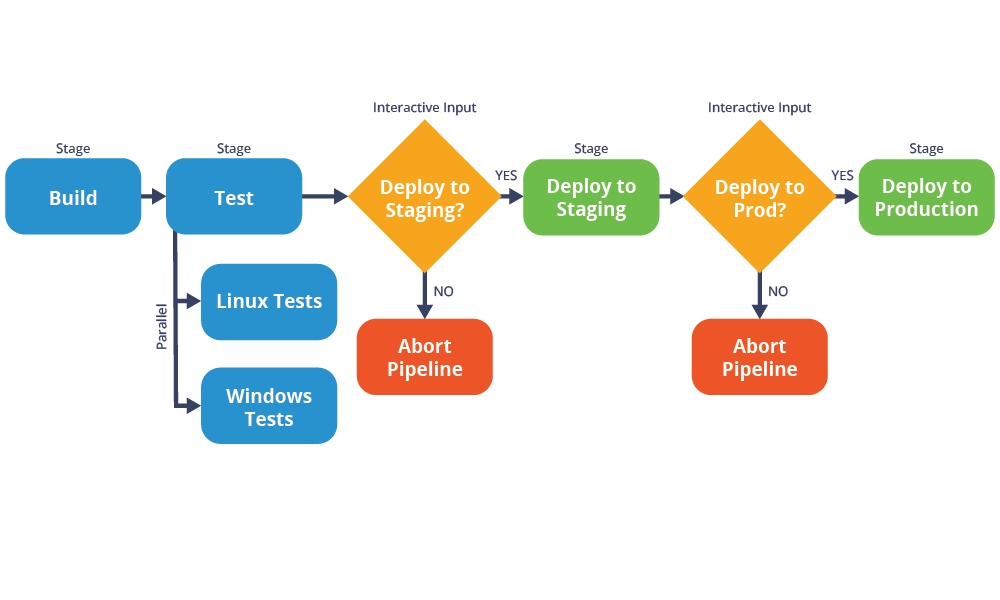

This repository describes a Jenkins Pipeline job to simulate a typical CI/CD workflow with the following set of stages:

- Build - In this stage, source code is compiled and built, and an artifact is generated.
- Test - In this stage, tests will be run in parallel on two different OS platforms, Linux and Windows.
- Deploy to Staging - Prior to deploying to a staging environment (essentially a pre-production server), we will request for human approval. If approved, the artifacts will be deployed to staging.
- Deploy to Production - We will request for human approval to deploy to production. If approved, artifacts will be deployed to the production environment.

We will also configure two post-build actions:

- Email notification in case of a build success.
- Email notification in case of a build failure.